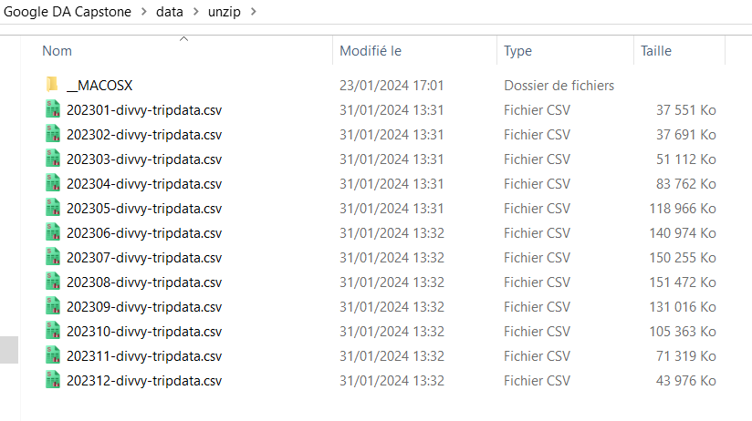
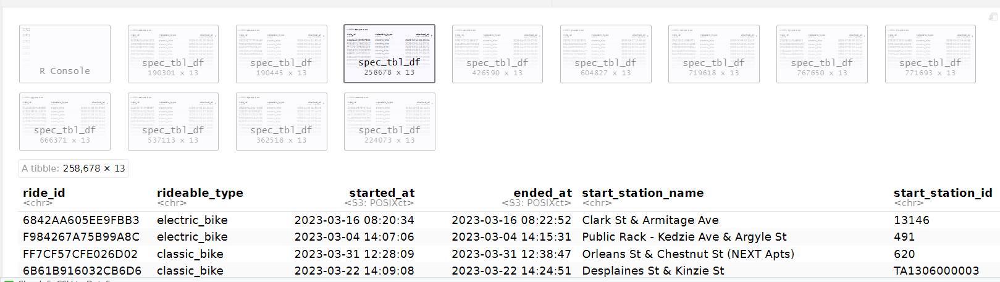

**Abstract:**\
In the context of a practical application project for the "Google Data Analysis Professional Certificate" program, I conducted this analysis and am sharing my work.

In this report, we include the details about different steps of analysis: Ask, Prepare, Process, Analyze and Share.

# Asking
The comprehensive details of the project are provided within a PDF document. This document encompasses all necessary information, including project objectives, methodologies, timelines, and any specific requirements essential for understanding and executing the project effectively.

*Reference document given by Lily Moreno the manager. See it [here](How-does-a-bike-share-navigate-speedy-success_.pdf)*

## Problem Definition
1.  *CYCLISTIC*, a bike-share company based in Chicago, is looking to expand its operations. Lily Moreno, my manager and the Marketing Director at CYCLISTIC, believes that the key to this expansion is to maximize the number of annual memberships and has a clear goal: Design marketing strategies aimed at converting casual riders into annual members. Three questions will guide the future marketing program:

    **1. How do annual members and casual riders use CYCLISTIC bikes differently?**

    **2. Why would casual riders buy CYCLISTIC annual memberships?**

    **3. How can CYCLISTIC use digital media to inuence casual riders to become members?**

I was assigned to answer the first question.

## Business task

**What is the problem I am trying to solve?** My study will explore the differences in the usage of *CYCLISTIC* bikes between individuals with annual memberships and those without. The insights I provide should assist my team in addressing additional questions related to the project:

-   Why would casual riders buy CYCLISTIC annual memberships?

-   How can CYCLISTIC use digital media to influence casual riders to become members?

**How can my insights drive business decisions?** Based on my analysis insights, the marketing team will design an effective campaign targeting casual riders to convert them in annual memberships. To be effective, the campaign will primarily focus on casual users based on their usage patterns of *CYCLISTIC* bikes. The executive team could then make a decision on approving the marketing program based on well-defined and compelling data insights.

# Data Prepare

In this section, we perform the necessary verification of the data source, install required R packages, download data archives, and prepare them for processing.  

**Data source location:**  
As stated in the reference document, data from the last twelve months will be utilized in this analysis, *ie.* from January 2023 to December 2023. Given data are sufficient to explore how different customer types are using CYCLISTIC bikes, no need to access personally identifiable information.  

**Data License:**  
The data has been made available by *Motivate International Inc.* under the license: *"non-exclusive, royalty-free, limited, perpetual license to access, reproduce, analyze, copy, modify, distribute in your product or service and use the Data for any lawful purpose"*  
Read complete license details [here](https://divvybikes.com/data-license-agreement)

Consequently, the data can be utilized for educational purposes, which is the context of the analysis presented here. I also confirm that under certain conditions, I have the right to download and share it with other deliverables, including in my portfolio. It is necessary to mention the license and the source of the data.

Data source: <https://divvy-tripdata.s3.amazonaws.com/index.html>

## Install packages

I employed RStudio version 2023.12.1-402 to prepare, process and analyze data. The following packages are used during project, ensure that they are installed correctly to avoid errors:  
**readr:** Read rectangular data  
**purrr:** Functional programming tools  
**dplyr:** Data manipulation  
**skimr:** Data summary  
**ggplot2:** Data visualization  
**patchwork:** Plot composition  
**geosphere:** Geospatial operations  
**lubridate:** Date/time manipulation  
**leaflet:** Interactive maps  
**leaflet.extras:** Enhanced map features  

```{r Install packages, warning=FALSE, results='hide', message=FALSE}
options(repos = c(CRAN = "https://cran.rstudio.com/"))

install_if_not_installed <- function(package_name) {
  if (!package_name %in% rownames(installed.packages())) {
    install.packages(package_name)
  }else {print(paste(package_name, " already installed"))}
}

install_if_not_installed("readr")
install_if_not_installed("purrr")
install_if_not_installed("dplyr")
install_if_not_installed("skimr")
install_if_not_installed("ggplot2")
install_if_not_installed("patchwork")
install_if_not_installed("geosphere")
install_if_not_installed("lubridate")
install_if_not_installed("ggmap")
install_if_not_installed("viridis") 
install_if_not_installed("leaflet")
install_if_not_installed("grid")
install_if_not_installed("magick")

library(readr)
library(purrr)
library(dplyr)
library(skimr)
library(ggplot2)
library(patchwork)
library(geosphere)
library(lubridate)
library(ggmap)
library(viridis)
library(leaflet)
library(magick)
library(grid)
```

## Download and extract archives

Here, we download dataset archives from the source and extract them.

### Download files

Download url: <https://divvy-tripdata.s3.amazonaws.com/index.html>  

   

Observe that the names of the files to be downloaded vary by two digits representing the month.

If you didn’t download all project files or you want to download again data files, delete or modify the folder “data/zip/” (201 Mo should be downloaded).   

**Important note:**

If the downloaded files are corrupt, the unzipping process will fail. This means we'll have to delete corrupted files, download and unzip them again.

```{r Download files, warning=FALSE, results='hide', message=FALSE}
# Destination folder, delete or modify the folder to download again (201 Mo to download)
destination_folder <- "data/zip/"

# Create destination folder if doesn't exist
if (!dir.exists(destination_folder)) {
  dir.create(destination_folder, recursive = TRUE)
}

# Files suffix corresponding to the two digits of the file month
month_numbers <- c("01", "02", "03", "04", "05", "06", "07", "08", "09", "10", "11", "12")

# Loop on twelve files
for (month in month_numbers) {
  # file url
  url <- paste0("https://divvy-tripdata.s3.amazonaws.com/2023", month, "-divvy-tripdata.zip")
  
  # file name extraction
  file_name <- basename(url)
  
  # destination file path
  destination_file <- file.path(destination_folder, file_name)
  
  # download the file
  options(timeout=300) # necessary to avoid error about connexion timeout limit
  if (!file.exists(destination_file)) {
  download.file(url, destination_file, mode = "wb")
    
  # display a message
  cat("Fichier téléchargé :", destination_file, "\n")
  }  else {
    cat("The file ", destination_file, " already exists.\n")
    # display information about existed file
    file_info <- file.info(destination_file)
    cat("Size of existed file :", file_info$size, "octets\n")
  }
}
```

The sizes of the twelve downloaded files vary significantly, which is logical considering that biking activity is influenced by weather conditions over months.

### Extract files

Now we extract files from downloaded archive files. Delete folder ‘unzip’ to unzip again. Extracted files are twelve csv files corresponding to twelve months of 2023.



```{r Extracted files, warning=FALSE, results='hide', message=FALSE}
# Source folder of archive files
source_zip_folder <- "data/zip/"

# Destination folder of unzipped files
destination_unzip_folder <- "data/unzip/"

# Create it if it doesn't already exist
if (!dir.exists(destination_unzip_folder)) {
  dir.create(destination_unzip_folder, recursive = TRUE)
}

# Retrieve the list of zip files
zip_files <- list.files(source_zip_folder, pattern = ".zip", full.names = TRUE)

# loop on the list files
for (zip_file in zip_files) {
  # extract current file
  file_name <- basename(zip_file)
  
  # complete path of unzipped file
  destination_path <- file.path(destination_unzip_folder)
  
  # unzip
  if (!file.exists(zip_file)) {
  unzip(zip_file, exdir = destination_path, overwrite = TRUE)
  
  # display a message
  cat("File ", zip_file, " extracted in :", destination_unzip_folder, "\n")
  } else {
    cat("File ", zip_file, " already exists \n")
  }
}
```

## Data organization

The data for 2023 is provided in a separate archived file for each month. The archive contains a csv file with data about all trips of the month. Following fields are given for every trip:

\- ***ride_id, rideable_type***: A unique ride identifier and a bike type, resp.;

\- ***started_at, ended_at***: Start and end time, of the trip resp.;

\- ***start_station_name, start_station_id, end_station_name, end_station_id***: Start station name and identifier, and end station name and identifier, resp.;

\- ***start_lat, start_lng, end_lat, end_lng***: Start station latitude and longitude, and end station latitude and longitude, resp.;

## Prepare Dataframes and explore structure

Here, we load CSV files into data frames, review the schema of each data frame, and merge them into a single data frame.

### Upload csv files in a list of data frames 'dfs'

A list of twelve data frames is obtained from the twelve csv files.



```{r uploaded dataframes, warning=FALSE, results='hide', message=FALSE}
# Path to the directory containing the CSV files
folder_path <- "data/unzip/"

# List of all CSV files
csv_files <- list.files(path = folder_path, pattern = "\\.csv$", full.names = TRUE)

# Read each csv file in a data frame
dfs <- lapply(csv_files, read_csv)

cat("The list dfs contains now ", length(dfs), " dataframes.", "\n")
# head(dfs, 12)
# length(dfs)
# lapply(dfs, class)
```

### Data of all months follows same scheme?

A preliminary observation in precedent step shows that twelve data frames share the same number of columns. In the following step, we will confirm that the entire structure of the data frames is identical, columns name and type. 

```{r Scheme}
# function returning a list of "column:type of column" couple
get_col_names_and_types <- function(df) {
  paste(names(df), sapply(df, class), sep = ":")
}

# Apply the function to the twelve data frames, we obtain a list of lists
col_info_list <- lapply(dfs, get_col_names_and_types)

# Check that all twelve lists are identical
are_same <- all(sapply(col_info_list[-1], identical, col_info_list[[1]]))
cat("All data frames have same scheme (columns name and type): ", are_same, "\n\n")
```

We conduct a comprehensive exploration of the properties of all columns on a monthly basis. This ensures that proportions of missing and erroneous values are effectively managed. The following characteristics were meticulously examined:

\- Start time (field started_at) is in the corresponding data set.\
- Erroneous data was identified through contextual analysis: Geographic coordinates must correspond to Chicago, a trip cannot exceed a reasonable distance, and the duration of a trip must be non-negative.\
- Missing values do not impact the analysis significantly, as their proportion is either minimal or the absent data is not critical for the analysis.

The data is generally of high quality and exhibits consistency, making it suitable for use in analytical purposes.

### Merge the twelve dataframes in one dataframe ‘df’

Having same scheme, the twelve dataframes are ready to be merged without additional transformation.


We display a summary of df columns.

```{r Merge twelve dataframes, warning=FALSE}
df <- bind_rows(dfs)
# df
# skim(df) 
summary(df)
# glimpse(df)
```

Using skim function on the year data set, we obtained global insights regarding data quality.  

0. There is in total 5719877 rows (5.7 millions), with following statistics about missing values:\
1. Missing values of start_station_name 875716 with missing ratio 15.31%\
2. Missing values of start_station_id is 875848, 15.31%\
3. Missing values of end_station_name is 929202, 16.24%\
4. Missing values of end_station_id is 929343 is 16.24%\
5. Missing values of end_lat is 6990, 0.12% 6. Missing values of end_lng is 6990, 0.12%

## Data explore
In this section, we explore our data, focusing primarily on two categories of features: time and geographic.

### Geographic coordiantes

### Missing coordinates

```{r Missing coordinates}
filtered <- df %>% 
  filter(is.na(start_lat) | is.na(start_lng))
cat("Number of missing start points is: ", nrow(filtered), "\n\n")

filtered <- df %>% 
  filter(is.na(end_lat) | is.na(end_lng))
cat("Number of missing end points is: ", nrow(filtered), "\n\n")

filtered <- df %>% 
  filter(is.na(end_lat) | is.na(end_lng))
cat("Distribution of missing end points over stations: ", "\n")

table(filtered$end_station_name, useNA = "ifany")
```

Start coordinates are always present but there are 6990 missing end points, corresponding to five end stations. It is probably caused by GPS signal issue for these stations. The problem occurs for about 1/1000 trips. However, we could use start point for analysis.

## Geographic distribution of coordinates
We calculate the centers of the start and end points, as well as the distance between these centers. Subsequently, we determine the distance of the start and end points from the center points and filter out those points that are more than 50km away. The three anomalous points are end points with latitude and longitude coordinates equal to zero, which is likely due to a technical issue. Note that we exclude the unavailable coordinates mentioned previously.

```{r Geographic coordiantes}
# Calculate the center of start points
start_center <- df %>%
  summarise(center_lat = mean(start_lat, na.rm = TRUE),
            center_lng = mean(start_lng, na.rm = TRUE))

# Calculate the center of end points
end_center <- df %>%
  summarise(center_lat = mean(end_lat, na.rm = TRUE),
            center_lng = mean(end_lng, na.rm = TRUE))
cat("Centers of start and end points are: (", end_center$center_lat, ", ", end_center$center_lng, ") and (", start_center$center_lat, ", ", start_center$center_lng, ")\n\n")

# Calculate distance between two centers
centers_distance <- distHaversine(c(start_center$center_lng, start_center$center_lat),
                          c(end_center$center_lng, end_center$center_lat))

cat("The distance between the two centers is", centers_distance, " meters. \n\n")

# start points far more than 50km from start points center?
filtered <- df %>% filter(distHaversine(c(start_center$center_lng, start_center$center_lat), cbind(df$start_lng, df$start_lat)) > 50000)
cat("There are ", nrow(filtered), " start points far more than 50km from start points center")

# end points far more than 50km from start points center?
filtered <- df %>% filter(distHaversine(c(start_center$center_lng, start_center$center_lat), cbind(df$end_lng, df$end_lat)) > 50000)
cat("There are ", nrow(filtered), " end points far more than 50km from start points center: \n\n")
select(filtered, start_lng, start_lat, end_lng, end_lat)
```

-   Distance between centers of start points and end points is reasonable (39 meters).  
-   Trips with distance more than 50 km are ignored, there are three such trips with end coordinates equal zero.  

### Trip times and duration
We study here the correctness of start and end times.

```{r message=TRUE, warning=TRUE, paged.print=TRUE}
# missing start times
filtered <- df %>% 
  filter(is.na(started_at) | is.na(ended_at))

cat("How much trips with missing time? ", nrow(filtered), "\n\n")
```

There is no missing values for start and end times.

```{r duration < 0}
# odd values (duration < 0)
filtered <- df %>% 
  filter(difftime(df$ended_at, df$started_at, units = "mins") < 0)

cat("How much trip with negative duration (impossible)? ", nrow(filtered), "\n\n")
```

The end date of a trip must necessarily be later than the start date. However, it has been observed that there are 272 trips that do not adhere to this logical requirement. This discrepancy is likely due to errors in the timekeeping mechanisms of the bicycles used.

```{r duration < 1}
# odd values (duration < 1, trip duration is less than one minute)
filtered <- df %>% 
  filter(difftime(df$ended_at, df$started_at, units = "mins") < 1)

cat("How much trip with duration less than one minute?: ", nrow(filtered), "\n\n")
```
Trips with duration positive but less than one minute are probably canceled for bikes functioning problem, their number is about 3% of total trips with proportion of users type casual/member similar to that of total trips. Hence, we could keep such trips.

```{r duration < 1 same station}
# odd values (duration < 1 with same start and end station)
filtered <- df %>% 
  filter(difftime(df$ended_at, df$started_at, units = "mins") < 1, start_station_id == end_station_id)

cat("How many trips are very short with same start and end stations?: ", nrow(filtered), "\n\n")
```
Half of very short trips don't leave depart station.

## Stations name and id

According to the project brief, there are approximately 600 stations.  

```{r Stations name and id}
cat("How many distinct start stations id we have?", length(unique(df$start_station_id)), "\n")

cat("How many distinct start stations name we have?", length(unique(df$start_station_name)), "\n")

cat("How many distinct end stations id we have?", length(unique(df$end_station_id)), "\n")

cat("How many distinct end stations name we have?", length(unique(df$end_station_name)), "\n\n")
```

The analysis shows that the number of 600 stations is not adhered to. There is inconsistency in this data that must be considered.

```{r same station id different name}
# same station id with different station names?
filtered <- df %>%
  group_by(start_station_id) %>%
  filter(n_distinct(start_station_name) > 1) %>%
  arrange(start_station_id) %>%
  distinct(start_station_id, start_station_name, .keep_all = TRUE) %>%
  ungroup() %>%
  select(start_station_id, start_station_name)
cat("How much Stations with same id and different station names?", nrow(filtered), "\n")

# The inverse: same station name with different station ids?
filtered <- df %>%
  group_by(start_station_name) %>%
  filter(n_distinct(start_station_id) > 1) %>%
  arrange(start_station_name) %>%
  distinct(start_station_name, start_station_id, .keep_all = TRUE) %>%
  ungroup() %>%
  select(start_station_name, start_station_id)
cat("How much stations with same name and different id?", nrow(filtered), "\n\n")
```
A small portion of 600 stations discrepancy is attributed to the inconsistent naming of stations or their IDs.

```{r Save df in CSV, echo=FALSE, warning=FALSE, results='hide', message=FALSE}
# write_csv(df, "df023_prepared.csv", quote = "all")
```
