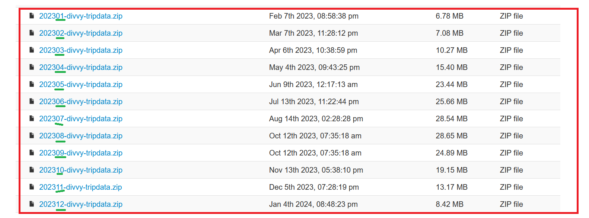

**Abstract:**\
In the context of a practical application project for the "Google Data Analysis Professional Certificate" program, I conducted this analysis and am sharing my work.

In this report, we include the details about different steps of analysis: Ask, Prepare, Process, Analyze and Share.

# Asking
The comprehensive details of the project are provided within a PDF document. This document encompasses all necessary information, including project objectives, methodologies, timelines, and any specific requirements essential for understanding and executing the project effectively.

*Reference document given by Lily Moreno the manager. See it [here](How-does-a-bike-share-navigate-speedy-success_.pdf)*

## Problem Definition
1.  *CYCLISTIC*, a bike-share company based in Chicago, is looking to expand its operations. Lily Moreno, my manager and the Marketing Director at CYCLISTIC, believes that the key to this expansion is to maximize the number of annual memberships and has a clear goal: Design marketing strategies aimed at converting casual riders into annual members. Three questions will guide the future marketing program:

    **1. How do annual members and casual riders use CYCLISTIC bikes differently?**

    **2. Why would casual riders buy CYCLISTIC annual memberships?**

    **3. How can CYCLISTIC use digital media to inuence casual riders to become members?**

I was assigned to answer the first question.

## Business task

**What is the problem I am trying to solve?** My study will explore the differences in the usage of *CYCLISTIC* bikes between individuals with annual memberships and those without. The insights I provide should assist my team in addressing additional questions related to the project:

-   Why would casual riders buy CYCLISTIC annual memberships?

-   How can CYCLISTIC use digital media to influence casual riders to become members?

**How can my insights drive business decisions?** Based on my analysis insights, the marketing team will design an effective campaign targeting casual riders to convert them in annual memberships. To be effective, the campaign will primarily focus on casual users based on their usage patterns of *CYCLISTIC* bikes. The executive team could then make a decision on approving the marketing program based on well-defined and compelling data insights.

# Data Prepare

In this section, we perform the necessary verification of the data source, install required R packages, download data archives, and prepare them for processing.  

**Data source location:**  
As stated in the reference document, data from the last twelve months will be utilized in this analysis, *ie.* from January 2023 to December 2023. Given data are sufficient to explore how different customer types are using CYCLISTIC bikes, no need to access personally identifiable information.  

**Data License:**  
The data has been made available by *Motivate International Inc.* under the license: *"non-exclusive, royalty-free, limited, perpetual license to access, reproduce, analyze, copy, modify, distribute in your product or service and use the Data for any lawful purpose"*  
Read complete license details [here](https://divvybikes.com/data-license-agreement)

Consequently, the data can be utilized for educational purposes, which is the context of the analysis presented here. I also confirm that under certain conditions, I have the right to download and share it with other deliverables, including in my portfolio. It is necessary to mention the license and the source of the data.

Data source: <https://divvy-tripdata.s3.amazonaws.com/index.html>

## Install packages

I employed RStudio version 2023.12.1-402 to prepare, process and analyze data. The following packages are used during project, ensure that they are installed correctly to avoid errors:  
**readr:** Read rectangular data  
**purrr:** Functional programming tools  
**dplyr:** Data manipulation  
**skimr:** Data summary  
**ggplot2:** Data visualization  
**patchwork:** Plot composition  
**geosphere:** Geospatial operations  
**lubridate:** Date/time manipulation  
**leaflet:** Interactive maps  
**leaflet.extras:** Enhanced map features  

```{r Install packages, warning=FALSE, results='hide', message=FALSE}
options(repos = c(CRAN = "https://cran.rstudio.com/"))

install_if_not_installed <- function(package_name) {
  if (!package_name %in% rownames(installed.packages())) {
    install.packages(package_name)
  }else {print(paste(package_name, " already installed"))}
}

install_if_not_installed("readr")
install_if_not_installed("purrr")
install_if_not_installed("dplyr")
install_if_not_installed("skimr")
install_if_not_installed("ggplot2")
install_if_not_installed("patchwork")
install_if_not_installed("geosphere")
install_if_not_installed("lubridate")
install_if_not_installed("ggmap")
install_if_not_installed("viridis") 
install_if_not_installed("leaflet")
install_if_not_installed("grid")
install_if_not_installed("magick")

library(readr)
library(purrr)
library(dplyr)
library(skimr)
library(ggplot2)
library(patchwork)
library(geosphere)
library(lubridate)
library(ggmap)
library(viridis)
library(leaflet)
library(magick)
library(grid)
```

## Download and extract archives

Here, we download dataset archives from the source and extract them.

### Download files

Download url: <https://divvy-tripdata.s3.amazonaws.com/index.html>  

   

Observe that the names of the files to be downloaded vary by two digits representing the month.

If you didn’t download all project files or you want to download again data files, delete or modify the folder “data/zip/” (201 Mo should be downloaded).   

**Important note:**

If the downloaded files are corrupt, the unzipping process will fail. This means we'll have to delete corrupted files, download and unzip them again.

```{r Download files, warning=FALSE, results='hide', message=FALSE}
# Destination folder, delete or modify the folder to download again (201 Mo to download)
destination_folder <- "data/zip/"

# Create destination folder if doesn't exist
if (!dir.exists(destination_folder)) {
  dir.create(destination_folder, recursive = TRUE)
}

# Files suffix corresponding to the two digits of the file month
month_numbers <- c("01", "02", "03", "04", "05", "06", "07", "08", "09", "10", "11", "12")

# Loop on twelve files
for (month in month_numbers) {
  # file url
  url <- paste0("https://divvy-tripdata.s3.amazonaws.com/2023", month, "-divvy-tripdata.zip")
  
  # file name extraction
  file_name <- basename(url)
  
  # destination file path
  destination_file <- file.path(destination_folder, file_name)
  
  # download the file
  options(timeout=300) # necessary to avoid error about connexion timeout limit
  if (!file.exists(destination_file)) {
  download.file(url, destination_file, mode = "wb")
    
  # display a message
  cat("Fichier téléchargé :", destination_file, "\n")
  }  else {
    cat("The file ", destination_file, " already exists.\n")
    # display information about existed file
    file_info <- file.info(destination_file)
    cat("Size of existed file :", file_info$size, "octets\n")
  }
}
```

The sizes of the twelve downloaded files vary significantly, which is logical considering that biking activity is influenced by weather conditions over months.

### Extract files

Now we extract files from downloaded archive files. Delete folder ‘unzip’ to unzip again. Extracted files are twelve csv files corresponding to twelve months of 2023.


```{r Extracted files, warning=FALSE, results='hide', message=FALSE}
# Source folder of archive files
source_zip_folder <- "data/zip/"

# Destination folder of unzipped files
destination_unzip_folder <- "data/unzip/"

# Create it if it doesn't already exist
if (!dir.exists(destination_unzip_folder)) {
  dir.create(destination_unzip_folder, recursive = TRUE)
}

# Retrieve the list of zip files
zip_files <- list.files(source_zip_folder, pattern = ".zip", full.names = TRUE)

# loop on the list files
for (zip_file in zip_files) {
  # extract current file
  file_name <- basename(zip_file)
  
  # complete path of unzipped file
  destination_path <- file.path(destination_unzip_folder)
  
  # unzip
  if (!file.exists(zip_file)) {
  unzip(zip_file, exdir = destination_path, overwrite = TRUE)
  
  # display a message
  cat("File ", zip_file, " extracted in :", destination_unzip_folder, "\n")
  } else {
    cat("File ", zip_file, " already exists \n")
  }
}
```

## Data organization

The data for 2023 is provided in a separate archived file for each month. The archive contains a csv file with data about all trips of the month. Following fields are given for every trip:

\- ***ride_id, rideable_type***: A unique ride identifier and a bike type, resp.;

\- ***started_at, ended_at***: Start and end time, of the trip resp.;

\- ***start_station_name, start_station_id, end_station_name, end_station_id***: Start station name and identifier, and end station name and identifier, resp.;

\- ***start_lat, start_lng, end_lat, end_lng***: Start station latitude and longitude, and end station latitude and longitude, resp.;

## Prepare Dataframes and explore structure

Here, we load CSV files into data frames, review the schema of each data frame, and merge them into a single data frame.

### Upload csv files in a list of data frames 'dfs'

A list of twelve data frames is obtained from the twelve csv files.


```{r uploaded dataframes, warning=FALSE, results='hide', message=FALSE}
# Path to the directory containing the CSV files
folder_path <- "data/unzip/"

# List of all CSV files
csv_files <- list.files(path = folder_path, pattern = "\\.csv$", full.names = TRUE)

# Read each csv file in a data frame
dfs <- lapply(csv_files, read_csv)

cat("The list dfs contains now ", length(dfs), " dataframes.", "\n")
# head(dfs, 12)
# length(dfs)
# lapply(dfs, class)
```

### Data of all months follows same scheme?

A preliminary observation in precedent step shows that twelve data frames share the same number of columns. In the following step, we will confirm that the entire structure of the data frames is identical, columns name and type. 

```{r Scheme}
# function returning a list of "column:type of column" couple
get_col_names_and_types <- function(df) {
  paste(names(df), sapply(df, class), sep = ":")
}

# Apply the function to the twelve data frames, we obtain a list of lists
col_info_list <- lapply(dfs, get_col_names_and_types)

# Check that all twelve lists are identical
are_same <- all(sapply(col_info_list[-1], identical, col_info_list[[1]]))
cat("All data frames have same scheme (columns name and type): ", are_same, "\n\n")
```

We conduct a comprehensive exploration of the properties of all columns on a monthly basis. This ensures that proportions of missing and erroneous values are effectively managed. The following characteristics were meticulously examined:

\- Start time (field started_at) is in the corresponding data set.\
- Erroneous data was identified through contextual analysis: Geographic coordinates must correspond to Chicago, a trip cannot exceed a reasonable distance, and the duration of a trip must be non-negative.\
- Missing values do not impact the analysis significantly, as their proportion is either minimal or the absent data is not critical for the analysis.

The data is generally of high quality and exhibits consistency, making it suitable for use in analytical purposes.

### Merge the twelve dataframes in one dataframe ‘df’

Having same scheme, the twelve dataframes are ready to be merged without additional transformation.


We display a summary of df columns.

```{r Merge twelve dataframes, warning=FALSE}
df <- bind_rows(dfs)
# df
# skim(df) 
summary(df)
# glimpse(df)
```

Using skim function on the year data set, we obtained global insights regarding data quality.  

0. There is in total 5719877 rows (5.7 millions), with following statistics about missing values:\
1. Missing values of start_station_name 875716 with missing ratio 15.31%\
2. Missing values of start_station_id is 875848, 15.31%\
3. Missing values of end_station_name is 929202, 16.24%\
4. Missing values of end_station_id is 929343 is 16.24%\
5. Missing values of end_lat is 6990, 0.12% 6. Missing values of end_lng is 6990, 0.12%

## Data explore
In this section, we explore our data, focusing primarily on two categories of features: time and geographic.

### Geographic coordiantes

### Missing coordinates

```{r Missing coordinates}
filtered <- df %>% 
  filter(is.na(start_lat) | is.na(start_lng))
cat("Number of missing start points is: ", nrow(filtered), "\n\n")

filtered <- df %>% 
  filter(is.na(end_lat) | is.na(end_lng))
cat("Number of missing end points is: ", nrow(filtered), "\n\n")

filtered <- df %>% 
  filter(is.na(end_lat) | is.na(end_lng))
cat("Distribution of missing end points over stations: ", "\n")

table(filtered$end_station_name, useNA = "ifany")
```

Start coordinates are always present but there are 6990 missing end points, corresponding to five end stations. It is probably caused by GPS signal issue for these stations. The problem occurs for about 1/1000 trips. However, we could use start point for analysis.

## Geographic distribution of coordinates
We calculate the centers of the start and end points, as well as the distance between these centers. Subsequently, we determine the distance of the start and end points from the center points and filter out those points that are more than 50km away. The three anomalous points are end points with latitude and longitude coordinates equal to zero, which is likely due to a technical issue. Note that we exclude the unavailable coordinates mentioned previously.

```{r Geographic coordiantes}
# Calculate the center of start points
start_center <- df %>%
  summarise(center_lat = mean(start_lat, na.rm = TRUE),
            center_lng = mean(start_lng, na.rm = TRUE))

# Calculate the center of end points
end_center <- df %>%
  summarise(center_lat = mean(end_lat, na.rm = TRUE),
            center_lng = mean(end_lng, na.rm = TRUE))
cat("Centers of start and end points are: (", end_center$center_lat, ", ", end_center$center_lng, ") and (", start_center$center_lat, ", ", start_center$center_lng, ")\n\n")

# Calculate distance between two centers
centers_distance <- distHaversine(c(start_center$center_lng, start_center$center_lat),
                          c(end_center$center_lng, end_center$center_lat))

cat("The distance between the two centers is", centers_distance, " meters. \n\n")

# start points far more than 50km from start points center?
filtered <- df %>% filter(distHaversine(c(start_center$center_lng, start_center$center_lat), cbind(df$start_lng, df$start_lat)) > 50000)
cat("There are ", nrow(filtered), " start points far more than 50km from start points center")

# end points far more than 50km from start points center?
filtered <- df %>% filter(distHaversine(c(start_center$center_lng, start_center$center_lat), cbind(df$end_lng, df$end_lat)) > 50000)
cat("There are ", nrow(filtered), " end points far more than 50km from start points center: \n\n")
select(filtered, start_lng, start_lat, end_lng, end_lat)
```

-   Distance between centers of start points and end points is reasonable (39 meters).  
-   Trips with distance more than 50 km are ignored, there are three such trips with end coordinates equal zero.  

### Trip times and duration
We study here the correctness of start and end times.

```{r message=TRUE, warning=TRUE, paged.print=TRUE}
# missing start times
filtered <- df %>% 
  filter(is.na(started_at) | is.na(ended_at))

cat("How much trips with missing time? ", nrow(filtered), "\n\n")
```

There is no missing values for start and end times.

```{r duration < 0}
# odd values (duration < 0)
filtered <- df %>% 
  filter(difftime(df$ended_at, df$started_at, units = "mins") < 0)

cat("How much trip with negative duration (impossible)? ", nrow(filtered), "\n\n")
```

The end date of a trip must necessarily be later than the start date. However, it has been observed that there are 272 trips that do not adhere to this logical requirement. This discrepancy is likely due to errors in the timekeeping mechanisms of the bicycles used.

```{r duration < 1}
# odd values (duration < 1, trip duration is less than one minute)
filtered <- df %>% 
  filter(difftime(df$ended_at, df$started_at, units = "mins") < 1)

cat("How much trip with duration less than one minute?: ", nrow(filtered), "\n\n")
```
Trips with duration positive but less than one minute are probably canceled for bikes functioning problem, their number is about 3% of total trips with proportion of users type casual/member similar to that of total trips. Hence, we could keep such trips.

```{r duration < 1 same station}
# odd values (duration < 1 with same start and end station)
filtered <- df %>% 
  filter(difftime(df$ended_at, df$started_at, units = "mins") < 1, start_station_id == end_station_id)

cat("How many trips are very short with same start and end stations?: ", nrow(filtered), "\n\n")
```
Half of very short trips don't leave depart station.

## Stations name and id

According to the project brief, there are approximately 600 stations.  

```{r Stations name and id}
cat("How many distinct start stations id we have?", length(unique(df$start_station_id)), "\n")

cat("How many distinct start stations name we have?", length(unique(df$start_station_name)), "\n")

cat("How many distinct end stations id we have?", length(unique(df$end_station_id)), "\n")

cat("How many distinct end stations name we have?", length(unique(df$end_station_name)), "\n\n")
```

The analysis shows that the number of 600 stations is not adhered to. There is inconsistency in this data that must be considered.

```{r same station id different name}
# same station id with different station names?
filtered <- df %>%
  group_by(start_station_id) %>%
  filter(n_distinct(start_station_name) > 1) %>%
  arrange(start_station_id) %>%
  distinct(start_station_id, start_station_name, .keep_all = TRUE) %>%
  ungroup() %>%
  select(start_station_id, start_station_name)
cat("How much Stations with same id and different station names?", nrow(filtered), "\n")

# The inverse: same station name with different station ids?
filtered <- df %>%
  group_by(start_station_name) %>%
  filter(n_distinct(start_station_id) > 1) %>%
  arrange(start_station_name) %>%
  distinct(start_station_name, start_station_id, .keep_all = TRUE) %>%
  ungroup() %>%
  select(start_station_name, start_station_id)
cat("How much stations with same name and different id?", nrow(filtered), "\n\n")
```
A small portion of 600 stations discrepancy is attributed to the inconsistent naming of stations or their IDs.

```{r Save df in CSV, echo=FALSE, warning=FALSE, results='hide', message=FALSE}
# write_csv(df, "df023_prepared.csv", quote = "all")
```


# Data Processing
In this section, we transform data by adding some new calculated columns, clean dirty data and prepare it for analysis.

## Utility functions
First we define a function used along the file to display sample of data calculated and another one to return the memory size of data frame.

```{r sample display, warning=FALSE, results='hide', message=FALSE}
# A function to display a sample of data
sample <- function(df, columns, n) {
  selected_df <- df %>%
    select(all_of(columns))
  
  unique_combinations <- df %>%
    distinct(across(all_of(columns)), .keep_all = TRUE)
  
  sampled_df <- unique_combinations %>%
    slice_sample(n = n)
  select(sampled_df, columns)
}

# A function to display memory size of data frame
size <- function(df) {
  size_in_bytes <- object.size(df)
  size_in_mb <- size_in_bytes / 1048576
  return(size_in_mb)
}
```

## Times columns calculation
We need to calculate some new columns about different time units

```{r Modify local settings to english, echo=FALSE, warning=FALSE, results='hide', message=FALSE}
# Set the United States as the regional parameter to use English names for months and days.
Sys.setlocale("LC_TIME", "en_US.UTF-8")
```

### Calculate month
Month of trips is calculated from start date.

```{r Month calculation, warning=FALSE, message=FALSE}
df$month <- month(df$started_at, label = TRUE)

sample(df, all_of(c("started_at", "month")), 10)
```

### Calculate day of week
Week day of trips is calculated from start date. We also define an order on values of day column.

```{r day calculation, warning=FALSE, message=FALSE}
df$day <- weekdays(df$started_at)

# define an order on days
df$day <- factor(df$day, levels = c("Monday", "Tuesday", "Wednesday", "Thursday", "Friday", "Saturday", "Sunday"))

sample(df, all_of(c("started_at", "day")), 10)
```

### Calculate hour of trip start
Hour column is calculated from start date.

```{r Hour calculation, warning=FALSE, message=FALSE}
df$hour <- hour(df$started_at)

sample(df, all_of(c("started_at", "hour")), 10)
```

### Calculate date of trip start
Date of trip is calculated from start date, the time part is ignored. This column is used to make daily analysis.

```{r date calcualtion, warning=FALSE, message=FALSE}
df$date <- date(df$started_at)

sample(df, all_of(c("started_at", "date")), 10)
```

### Calculate season of trip
Season of trip is calculated from month: Spring: "Mar", "Apr", "May"; Summer: "Jun", "Jul", "Aug"; Autumn: "Sep", "Oct", "Nov"; Winter: "Dec","Jan", "Feb";

```{r season calculation, warning=FALSE, message=FALSE}
df <- df %>%
  mutate(
    season = case_when(
      month %in% c("Mar", "Apr", "May") ~ "spring",
      month %in% c("Jun", "Jul", "Aug") ~ "summer",
      month %in% c("Sep", "Oct", "Nov") ~ "autumn",
      TRUE ~ "winter" # Décembre, janvier, février
    )
  )

sample(df, all_of(c("month", "season")), 10)
```

### Calculate duration column
We calculate duration of each trip.

```{r duration column, warning=FALSE, results='hide', message=FALSE}
df$duration <- difftime(df$ended_at, df$started_at, units = "mins")

sample(df, all_of(c("started_at", "ended_at", "duration")), 10)
```

## Geographic columns calculation
Here we calculate two new columns about distance of trips.

### Calculate distance of trips
Straight-line distance is calculated from start and end points coordinates, using Haversine formula.

```{r distance column, warning=FALSE, message=FALSE}
df$distance <- ifelse(
  !is.na(df$start_lat) & !is.na(df$start_lng) & !is.na(df$end_lat) & !is.na(df$end_lng),
  distHaversine(
    cbind(df$start_lat, df$start_lng),
    cbind(df$end_lat, df$end_lng)
  )/1000,NA
)
sample(df, all_of(c("start_lat", "start_lng", "end_lat", "end_lng", "distance")), 10)
```

### Calculate distance category
We calculate distance categories labeled: [0, 1km], ]1km, 3km], ]3km, 10km], ]10km, 50km] and "Not defined". Last category contains distance greater than 50km.

```{r distance calculation, warning=FALSE, message=FALSE}
# Categorize the trips based on distance
df <- df %>%
  mutate(dist_cat = case_when(
    distance <= 1 ~ "0<d<1km",
    distance > 1 & distance <= 3 ~ "1km<d<3km",
    distance > 3 & distance <= 10 ~ "3km<d<10km",
    distance > 10 & distance <= 50 ~ "10km<d<50km",
    TRUE ~ "Abnormal distance" # For distances that don't fall into the specified ranges
  ))
# define an order on dist_cat values.
df$dist_cat<- factor(df$dist_cat, levels = c("0<d<1km", "1km<d<3km", "3km<d<10km", "10km<d<50km", "Abnormal distance"))

sample(df, all_of(c("distance", "dist_cat")), 10)
```

## Reorder columns and suppression
Here we delete unused columns and reorder new calculated columns.

### Delete rows with negative duration or distance \> 50km
**Important observation:**  
Transformations deleting or modifying data must be validated by the manager. 

Impossible trips with negative duration ('ended_at < started_at') holds for 272 rows. There may have been a technical error stemming from the synchronization of the internal timekeeping mechanism.

```{r negative duration supression}
original_nrow <- nrow(df)
df <- subset(df, duration >= 0)
ignored_rows <- original_nrow - nrow(df)

cat("Number of rows ignored, trips with negative duration:", ignored_rows, "\n")
```

Only three rows hold, we don't delete rows missing distance because they are due to missing end coordinates.

```{r distance > 50km supression}
original_nrow <- nrow(df)
df <- subset(df, distance <= 50 | is.na(distance))
ignored_rows <- original_nrow - nrow(df)

cat("Number of rows ignored, trips with too high distance:", ignored_rows, "\n")
```

### Reorder columns and delete unused ones
Modify the order of columns.

```{r Reorder columns}
df <- df %>%
  relocate(season, date, month, day, hour, duration, distance, dist_cat, .after = ended_at)

sample(df, all_of(c("season", "date", "month", "day", "hour", "duration", "distance", "dist_cat")), 10)
```

Delete unused columns to decrease size of manipulated data set. Following columns are deleted: *started_at, ended_at, start_station_name, start_station_id, end_station_name, end_station_id, end_lat, end_lng*
```{r Delete unused columns}
original_size <- size(df)

df <- df %>% 
      select(-c(ride_id, started_at, ended_at, end_station_id, end_station_name, start_station_id))

new_size <- size(df)

cat("Original size before suppression was ", original_size, " Mo, and become ", new_size, " Mo", " after suppression: ")
```


```{r Save processed in CSV, echo=FALSE, warning=FALSE, results='hide', message=FALSE}
# write_csv(df, "df023_processed.csv", quote = "all")
```


# Data analysis
Now the data is reliable, original, current, and cited which makes it easier to analyze. We do it across various features to uncover insights regarding the differences between casual and member bikers.

## Time analysis
Time analysis will be conducted across different periods, including daytime, weekdays, months, and seasons.

### Annual ratio of casual bikers
What are ratios of bikers types?

```{r Annual ratio, fig.width=12, fig.height=6}
# Number of all trips
total_trips <- nrow(df)

# Number of all trips with member_casual = 'casual'
casual_trips <- sum(df$member_casual == 'casual')

# Percentage of trips that are casual
percentage_casual <- (casual_trips / total_trips) * 100

# Display the results
cat("Number of all trips:", total_trips, "\n", "Number of trips with casual bikers:", casual_trips, "\n", "with percentage :", round(percentage_casual), "% of all bikers. \n")
# cat("Number of trips with member_casual = 'casual':", casual_trips, "\n")
# cat("Percentage of trips that are casual:", percentage_casual, "%\n")
```

### Variation over the year
Variation in the ratios of biker types throughout the year.

```{r fig.width=12, fig.height=6}
# Calculate counts by user type for each day
df_summary <- df %>%
  group_by(date, member_casual) %>%
  summarize(count = n(), .groups = 'drop') %>%
  group_by(date)

ggplot(df_summary, aes(x = date, y = count, fill = member_casual)) +
  geom_bar(stat = "identity", position = "dodge") +
  theme_minimal() +
  labs(title = "Casual vs Member over 2023",
       x = "Date",
       y = "Trips Count",
       fill = "User Type")
```
Most of the days, the number member riders is greater than casual riders. 

```{r casual highest, fig.width=12, fig.height=6}
df_summary <- df %>%
  group_by(date, member_casual) %>%
  summarise(count = n(), .groups = 'drop') %>%
  group_by(date) %>%
  mutate(total = sum(count), 
         ratio = count / total * 100) %>%
  filter((member_casual == "casual" & ratio >= 50) | (member_casual == "member" & ratio < 50))

cat("Number of days over 2023 where most of bikers are casual: ", nrow(df_summary))
```
Number of casual bikers trips is greater than member bikers trips over 58 days of 2023. Almost all were on week ends.

### Variation over months
In which months are casual users more prevalent?

```{r fig.width=12, fig.height=6}
# Calculate counts and percentages by user type and month
df_summary <- df %>%
  group_by(month, member_casual) %>%
  summarize(count = n(), .groups = 'drop') %>%
  group_by(month) %>%
  mutate(total = sum(count),
         percentage = count / total * 100)

ggplot(df_summary, aes(x = month, y = count, fill = member_casual)) +
  geom_bar(stat = "identity", position = "dodge") +
  geom_text(aes(label = sprintf("%.1f%%", percentage)), 
            position = position_dodge(width = 0.9), 
            vjust = -0.25, # Adjust based on your plot's needs
            hjust=0.5) + # Center the text in the dodge position
  theme_minimal() +
  labs(title = "Count of Casual vs Member by Month",
       x = "Month",
       y = "Trips Count",
       fill = "User Type")
```

### Variation over seasons
Which season is most favorable for casual biking?

```{r fig.width=12, fig.height=6}
# Calculate the percentage of trips in each category
df_summary <- df %>%
  group_by(season, member_casual) %>%
  summarise(count = n(), .groups = 'drop') %>%
  group_by(season) %>%
  mutate(total = sum(count), 
        ratio = count / total * 100,
        legend_text = paste(member_casual, "-", paste0(round(ratio, 1), "%")))

# Create a list to store ggplot objects
plot_list <- list()

# Loop through each unique season to create a pie chart for each
for(sea in unique(df_summary$season)) {
  data_filtered <- df_summary %>% 
    filter(season == sea)

  p <- ggplot(data_filtered, aes(x = "", y = ratio, fill = legend_text)) +
    geom_bar(width = 1, stat = "identity") +
    coord_polar("y", start = 0) +
    labs(fill = "User type", title = sea) +
    theme_void() +
    theme(legend.title = element_text(size = 10), legend.text = element_text(size = 8))
  
  # Add the plot to the list
  plot_list[[sea]] <- p
}

# Combine all plots using patchwork
plot_combined <- wrap_plots(plot_list, ncol = 2)

# Print the combined plot
plot_combined
```
Certainly, there's a discernible correlation between the number of bike rides and the progression of months and seasons, which can likely be attributed to weather variations. To better understand this relationship, we sourced average temperature data for Chicago throughout the year and illustrated the fluctuations through graphical representation. The temperature data is given by CHATGPT 4.

```{r temperature variation}
df_temp <- data.frame(
  month = c('Jan', 'Feb', 'Mar', 'Apr', 'May', 'Jun', 'Jul', 'Aug', 'Sep', 'Oct', 'Nov', 'Dec'),
  Temperature_C = c(-3, -1, 4, 10, 16, 21, 24, 23, 19, 13, 7, 1)
)

df_trips_per_month <- df %>%
  group_by(month, member_casual) %>%
  summarise(Trips_Count = n(), .groups = 'drop')

merged_df <- merge(df_trips_per_month, df_temp, by = "month", all = TRUE)
merged_df$month <- factor(merged_df$month, levels = c("Jan", "Feb", "Mar", "Apr", "May", "Jun", "Jul", "Aug", "Sep", "Oct", "Nov", "Dec"), ordered = TRUE)

# Create a ggplot chart with dual axistrips count and mean temperature
ggplot(merged_df, aes(x = month, fill = member_casual)) +
  geom_bar(aes(y = Trips_Count), position = 'dodge', stat = 'identity') +
  geom_line(aes(y = Temperature_C * 20000, group = 1), color = "yellow", linewidth = 2) + # Multiplying by a factor for scale
  geom_text(aes(x = "Jun", y = 5e+05), label = "Average monthly temperature", color = "brown") +
  scale_y_continuous(sec.axis = sec_axis(~./18856, name = "Temperature (°C)")) + # Adjusting the secondary axis
  labs(y = "Count of Trips", x = "Month") +
  theme_minimal() +
  theme(axis.text.x = element_text(angle = 45, hjust = 1)) + # Improve month labels readability
  labs(title = "Monthly Trips Count and Average Temperature in Chicago City - 2023", fill = "User Type")
```
  
  
The correlation between the number of trips, especially those by casual users, and the temperature is evident and logically coherent.

### Variation over week days
What trends occur across the weekdays?

```{r fig.width=12, fig.height=6}
# Calculate counts and percentages
df_summary <- df %>%
  group_by(day, member_casual) %>%
  summarize(count = n(), .groups = 'drop') %>%
  group_by(day) %>%
  mutate(total = sum(count),
         percentage = count / total * 100)

ggplot(df_summary, aes(x = day, y = count, fill = member_casual)) +
  geom_bar(stat = "identity", position = "dodge") +
  geom_text(aes(label = sprintf("%.1f%%", percentage)), 
            position = position_dodge(width = 0.9), 
            vjust = -0.25,
            hjust=0.5) +
  theme_minimal() +
  labs(title = "Count of Casual vs Member by WeekDay",
       x = "Day",
       y = "Trips Count",
       fill = "User Type")
```

### Variation over hours of day
During the day, when does casual biking increase?

```{r fig.width=12, fig.height=6}
df_summary <- df %>%
  group_by(hour, member_casual) %>%
  summarize(count = n(), .groups = 'drop') %>%
  group_by(hour) %>%
  mutate(total = sum(count),
         percentage = count / total * 100)

ggplot(df_summary, aes(x = hour, y = count, fill = member_casual)) +
  geom_bar(stat = "identity", position = "dodge") +
  geom_text(aes(label = sprintf("%.1f%%", percentage)), 
            position = position_dodge(width = 0.9), 
            vjust = 0.5,
            hjust= 0,
            angle = 90) +
  scale_x_continuous(breaks = 0:23) +
  labs(title = "Count of Casual vs Member by Hour",
       x = "Hour",
       y = "Trips Count",
       fill = "User Type") +
  theme_minimal()
```

Hourly analysis indicates a significant late-night usage of CYCLISTIC's services, with a notably higher percentage of casual users during these hours. This suggests that the service also caters to individuals facing public transportation challenges at night.

## Geographic Analysis
In this subsection, an analysis is conducted on geographic data.

### Trips distance distribution
First, we examine the variation in the number of trips across different trip distances.

```{r fig.width=12, fig.height=6, warning=FALSE, message=FALSE}
ggplot(df, aes(x = distance)) +
  geom_histogram(binwidth = 1,
                 color = "black", fill = "blue") +
  theme_minimal() +
  scale_x_continuous(breaks = 0:50) +
  labs(title = "Frequency of trips by Distance",
       x = "Distance (km)", 
       y = "Number of Trips")
```

### Variation over distance categories
The above chart guides the definition of distance categories in the preparation section and following analysis.

```{r fig.width=12, fig.height=6, warning=FALSE, message=FALSE}
df_summary <- df %>%
  group_by(dist_cat, member_casual) %>%
  summarise(count = n(), .groups = 'drop') %>%
  group_by(dist_cat) %>%
  mutate(total = sum(count), 
        ratio = count / total * 100,
        legend_text = paste(member_casual, "-", paste0(round(ratio, 1), "%")))

# Create a list to store ggplot objects
plot_list <- list()

# Loop through each unique dist_cat to create a pie chart for each
for(category in unique(df_summary$dist_cat)) {
  # Filter the data for the current category
  data_filtered <- df_summary %>% 
    filter(dist_cat == category)
  
  # Create the pie chart for the current category
  p <- ggplot(data_filtered, aes(x = "", y = ratio, fill = legend_text)) +
    geom_bar(width = 1, stat = "identity") +
    coord_polar("y", start = 0) +
    labs(fill = category) +
    theme_void() +
    theme(legend.title = element_text(size = 20), legend.text = element_text(size = 16))
  
  # Add the plot to the list
  plot_list[[category]] <- p
}

# Combine all plots using patchwork
plot_combined <- wrap_plots(plot_list, ncol = 3) # Adjust ncol as needed for layout

# Print the combined plot
plot_combined
```

There is 6990 trips are without distance because end coordinates are missing. Most of these trips are casual trips. If we suppose missing end coordinates corresponding to lost bikes, it means that casual bikers lost vehicles more than subscribed members.

### Most used stations over bikers type
Where are the most frequently used stations for both types of bikers located in Chicago?

```{r fig.width=8, fig.height=6}
# Calculate the most used stations of casual bikers
top_casual_stations <- df %>%
  filter(!is.na(start_station_name), member_casual == 'casual') %>%  # Exclude rows where start_station_name is NA
  group_by(start_station_name) %>%
  summarise(
    count = n(),
    start_lat = first(start_lat),  # Capture the first latitude value for the group
    start_lng = first(start_lng),  # Capture the first longitude value for the group
    .groups = 'drop'
  ) %>%
  arrange(desc(count)) %>%
  slice_head(n = 30)

# Calculate the most used stations of members bikers
top_member_stations <- df %>%
  filter(!is.na(start_station_name), member_casual == 'member') %>%  # Exclude rows where start_station_name is NA
  group_by(start_station_name) %>%
  summarise(
    count = n(),
    start_lat = first(start_lat),  # Capture the first latitude value for the group
    start_lng = first(start_lng),  # Capture the first longitude value for the group
    .groups = 'drop'
  ) %>%
  arrange(desc(count)) %>%
  slice_head(n = 30)

# map
m <- leaflet() %>%
  addTiles()  # Add default OpenStreetMap map tiles

# Add markers for casual stations in blue
m <- m %>%
  addCircleMarkers(data = top_casual_stations, 
                   lng = ~start_lng, lat = ~start_lat, 
                   popup = ~paste("<b>", start_station_name, "</b><br>", count, " Trips"), color = "blue", 
                   group = "Casual Top Stations")

# Add markers for member stations in red
m <- m %>%
  addCircleMarkers(data = top_member_stations, 
                   lng = ~start_lng, lat = ~start_lat, 
                   popup = ~paste("<b>", start_station_name, "</b><br>", count, " Trips"), color = "red", 
                   group = "Member Top Stations")

# Adjust the map view to include all markers
data = bind_rows(top_casual_stations, top_member_stations)
bounds <- c(min(data$start_lng), min(data$start_lat), max(data$start_lng), max(data$start_lat))
m <- m %>% fitBounds(lng1 = bounds[1], lat1 = bounds[2], lng2 = bounds[3], lat2 = bounds[4])

# Optionally, add a layer control to toggle the visibility of each group
m <- m %>%
  addLayersControl(overlayGroups = c("Casual Top Stations", "Member Top Stations"),
                   options = layersControlOptions(collapsed = FALSE))

# Print the map
m
```

### Bike types
How are bikers distributed across the three types of bikes?

```{r fig.width=12, fig.height=6}
# Calculate the percentage of trips in each bike type
df_summary <- df %>%
  group_by(rideable_type, member_casual) %>%
  summarise(count = n(), .groups = 'drop') %>%
  group_by(rideable_type) %>%
  mutate(total = sum(count), 
          ratio = count / total * 100,
          legend_text = paste(member_casual, "-", paste0(round(ratio, 1), "%")))

# Create a list to store ggplot objects
plot_list <- list()
# Loop through each unique rideable_type to create a pie chart for each
for(type in unique(df_summary$rideable_type)) {
  # Filter the data for the current type
  data_filtered <- df_summary %>% 
    filter(rideable_type == type)
  
  # Create the pie chart for the current type
  p <- ggplot(data_filtered, aes(x = "", y = ratio, fill = legend_text)) +
    geom_bar(width = 1, stat = "identity") +
    coord_polar("y", start = 0) +
    labs(fill = type) +
    theme_void() +
    theme(legend.title = element_text(size = 20), legend.text = element_text(size = 16))
  
  # Add the plot to the list
  plot_list[[type]] <- p
}

# Combine all plots using patchwork
plot_combined <- wrap_plots(plot_list, ncol = 2) # Adjust ncol as needed for layout

# Print the combined plot
plot_combined
```

The absence of member usage of docked bikes suggests that the CYCLISTIC system may not permit such use. Also, casual bikers have a slight preference for electric bikes.


# Share insights

## Business objective and audience

Let's remember the three key questions that will guide our team in the upcoming marketing program:

**1. How do annual members and casual riders use CYCLISTIC bikes differently?**

**2. Why would casual riders buy CYCLISTIC annual memberships?**

**3. How can CYCLISTIC use digital media to inuence casual riders to become members?**

This analysis tackles the first question to aid my team in addressing the remaining two.
Hence, my audience could be marketing team, designers and project manager.

## Main insights

The study revealed a variance in usage patterns between casual and member cyclists across multiple dimensions:

**1.  Global evaluation:**  
In general, the number of member rides exceeds that of casual rides, which can be attributed to the ease and reduced cost of member usage.
    This trend has exceptions on 58 days of the year 2023.

**2.  Weather and leisure:**  
The total number of rides generally increases with good weather (spring and summer) and during weekend days, particularly for casual rides.

**3.  Night circumstances:** Conversely, the total number of rides decreases late at night (between 11 PM and 3 AM), but the proportion of casual rides increases.
    This can be attributed to the lack of public transportation during these hours, prompting unregistered cyclists to opt for bike rentals.

**4.  Rides losing bikes:**  
The proportion of casual cyclists increases sharply for rides without an end date, which can be explained by bike loss or theft, likely due to inexperience with using the service.

5.  Electric bikes are slightly favored by casual users, while recumbent bikes are never used.

6.  The most frequented stations by casual cyclists are closer to Lake Michigan, while members tend to use stations near the city center.
    This pattern can be attributed to the fact that many casual users are tourists.

## Some recommandations

According to insights given above, I recommend following:\
Based on the observations about the use by casual versus member riders, here are some recommendations:

**1.  Targeted Membership Promotions:**  
- Implement targeted promotions on the 58 days where casual rides spike, offering discounts or trial memberships to encourage casual riders to become members.  
- Offer special membership rates or perks for first-time users to convert them into members right after their first ride.  

**2.  Seasonal and Weekend Marketing:**  
- Develop and market special membership packages for spring and summer, highlighting the benefits of biking in good weather.  
- Promote weekend passes or discounts to attract more casual riders during these peak times, potentially converting them into members.  
**3. Night-Time Usage Incentives:**  
- Introduce night-time ride discounts or safety campaigns to encourage more rides during late hours, addressing the gap in public transportation.  
- Partner with local businesses or events that operate late to offer promotions that encourage biking to and from these locations.  

**4. Education and Theft Prevention:**  
- Launch an educational campaign targeting casual riders on how to securely lock bikes and the benefits of membership, including any theft-protection services offered.  
- Explore options for better bike tracking and security features to reduce the incidence of lost or stolen bikes, reassuring potential users.  

**5. Electric Bike Promotion:**  
- Since electric bikes are favored by casual users, create marketing campaigns highlighting the availability and benefits of electric bikes, possibly including tutorials or guided tours that showcase their ease of use.  
- Offer membership benefits that specifically cater to electric bike users, such as guaranteed availability or extended battery life.  

**6. Geographically Targeted Strategies:**  
- For casual riders frequenting stations near Lake Michigan, develop tourist-friendly packages or partnerships with local tourist attractions to offer combined passes or discounts.  
- Enhance the visibility and accessibility of bike stations in tourist-heavy areas with additional signage, maps, and digital app features aimed at tourists.  
- Conduct targeted advertising in city center areas to attract members with promotions highlighting the convenience of bike usage for daily commutes or city exploration.  

**7. Diversify Bike Options:**  
- Considering the lack of use of recumbent bikes, evaluate the fleet and consider reallocating resources towards more popular bike types among both casual and member riders.  
- Solicit feedback from users on bike preferences and potential improvements to ensure the service meets the needs of a diverse user base.  

## Further studies: 
I suggest the following avenues for exploring new questions that have emerged and to push the analysis further:

- The reference document refers to 600 stations, yet the data contains over 1500 unique values for station names and IDs. Given the inability to acquire additional data, I recommend conducting an analysis to identify the 600 stations mentioned.

- It's feasible to obtain the geographical coordinates of major public facilities in Chicago, including transportation hubs, shopping centers, and tourist landmarks. Subsequently, one could analyze their correlation with the types of riders. 

- Other dimensions could be considered, for example the rides speed which could be obtained from distance and duration.